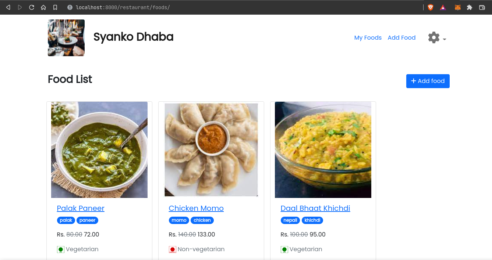
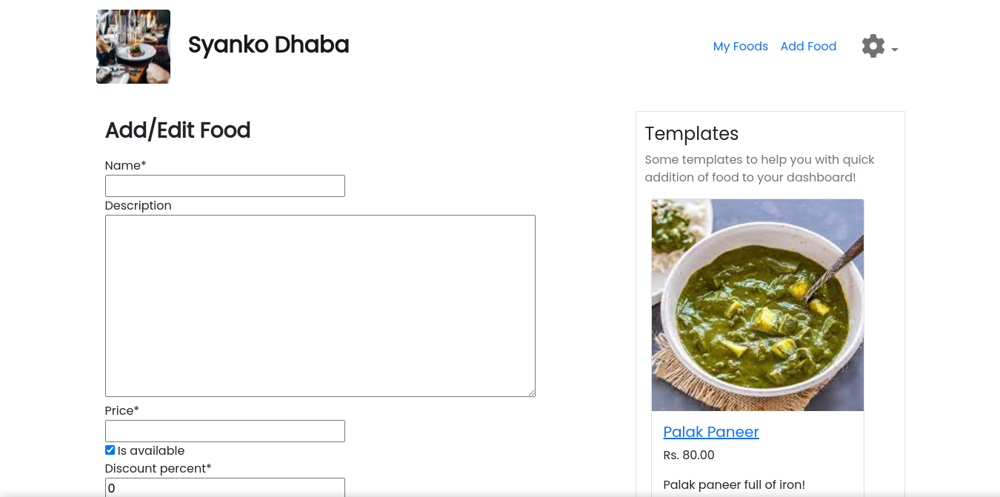
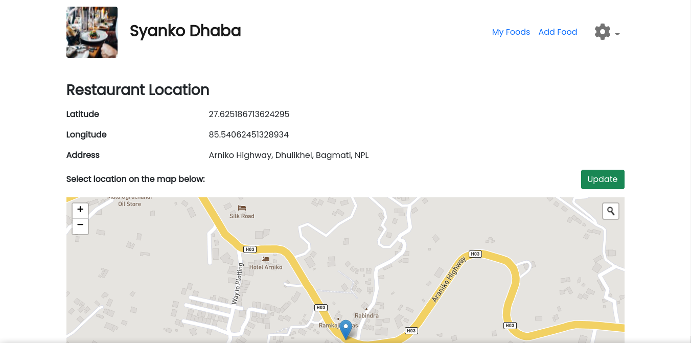

# Foodie

## Introduction 

***Foodie*** is a mobile/web application-based online food delivery service, that aims to provide restaurants and customers with a common platform to sell and buy cuisines.

It has a web interface for restaurants and mobile apps for customers and delivery persons respectively.

## Getting Started

### Frontend

Run the project using:

```
flutter run
```

### Backend

Set up virtual environment and install the dependencies using the commands:

```
python3 -m venv venv
source venv/bin/activate
pip install -r requirements.txt
```

Then run the Django development server using:

```
python manage.py runserver
```

To create a superuser (admin) account, run:

```
python manage.py createsuperuser
```

API can be accessed through the base url `http://localhost:8000`.

## Screenshots

Restaurant interface





